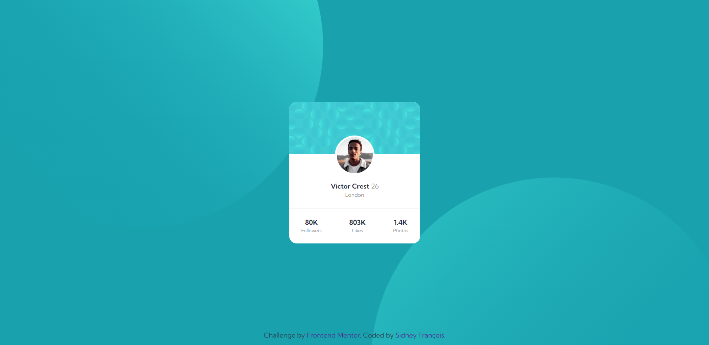

# Frontend Mentor - Interactive rating component solution

This is a solution to the [Profile card component](https://www.frontendmentor.io/challenges/profile-card-component-cfArpWshJ). Interesting design that can be used as a component in a social media plataform or as a user presentation. All design specifications can be seen in [style-guide.md](./style-guide.md)

### Screenshot

### Links

- Solution URL: [Frontend Mentor Solution](https://www.frontendmentor.io/solutions/use-of-absolute-position-no-use-of-fixed-width--I9egkZtku)
- Live Site URL: [Live Site at Netlify](https://euphonious-lokum-2e9cbf.netlify.app/)

## My process

### Built with

- HTML5
- Flexbox
- Absolute position
- Image as background

### What I learned

The behavior of the properties (top, right, bottom and left) in a positioned element is not so intuitive. First, by default the element stays in the same position if it were static, [as mentioned in the mdn](https://developer.mozilla.org/en-US/docs/Web/CSS/right) (that's why I first positioned the user image in the center before make it absolutely positioned). If the absolutely positioned element does not fill the available space one of the properties can be descarted, left wins right (depending of the direction) and top wins bottom, [as specified in the mdn](https://developer.mozilla.org/en-US/docs/Web/CSS/position).

The use of two or more images along with a fixed color to compose a background.

## Author

- Github - [sidneyfrancois](https://github.com/sidneyfrancois)
- Frontend Mentor - [@sidneyfrancois](https://www.frontendmentor.io/profile/sidneyfrancois)
